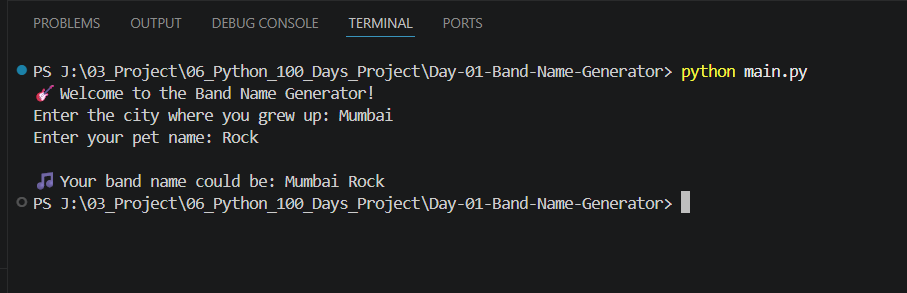

# 🚀 Day 01 - Band Name Generator | 100 Days of Python

## 📌 Project Overview

This project is part of my **100 Days of Python Challenge**.

The objective of this beginner-friendly project is to create a simple Band Name Generator that combines the user's hometown and pet name to generate a fun band name.

Although the logic is simple, this project reinforces the importance of user input, variables, string concatenation, and output formatting, which are fundamental concepts used in Python programming.

---

## 🎯 Objectives

* Practice taking user input
* Understand Python variables
* Learn string concatenation
* Display formatted output

---

## 🛠️ Technologies Used

* Python 3

---

## 📚 Concepts Revised

* Variables
* Input Function
* Print Function
* String Concatenation
* Basic Program Flow

---

## 💻 Source Code

```python
print("🎸 Welcome to the Band Name Generator!")

city = input("Enter the city where you grew up: ")
pet = input("Enter your pet name: ")

print(f"\n🎵 Your band name could be: {city} {pet}")
```

---

## ▶️ Sample Output

```text
Enter the city where you grew up: Mumbai
Enter your pet name: Bruno

Your band name will be Mumbai Bruno
```

---

## 📷 Project Output

Add your project screenshot here.

Example:



---

## 📖 What I Revised Today

While revisiting this project, I strengthened my understanding of:

* Taking user input
* Variable assignment
* String manipulation
* Writing simple interactive console applications

As a Python Backend Developer, revisiting these fundamentals helps build stronger problem-solving skills and cleaner production code.

---

## 📂 Project Structure

```
Day-01-Band-Name-Generator
│
├── README.md
├── main.py
├── output.png
├── demo.gif (Optional)
└── requirements.txt
```

---

⭐ Follow my journey as I complete the **100 Days of Python Challenge** while continuously improving my Python and Backend Development skills.
