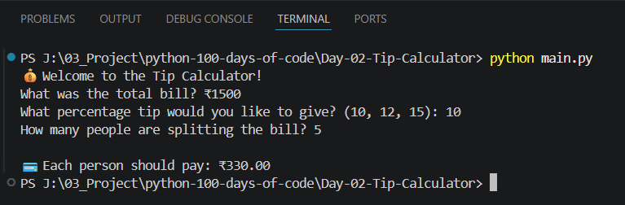

# 💰 Day 02 - Tip Calculator | 100 Days of Python

## 📌 Project Overview

This project is part of my **100 Days of Python Challenge**.

The objective of this project is to build a Tip Calculator that calculates how much each person should pay after adding a selected tip percentage and splitting the bill among multiple people.

Although the logic is straightforward, this project reinforces important programming concepts such as user input handling, variables, arithmetic operations, percentage calculations, and formatted output, which are commonly used in real-world software development.

---

## 🎯 Objectives

* Practice taking user input
* Perform arithmetic calculations
* Calculate percentages
* Format floating-point values
* Display formatted output using f-Strings

---

## 🛠️ Technologies Used

* Python 3

---

## 📚 Concepts Revised

* Variables
* Input Function
* Data Type Conversion (`int`, `float`)
* Arithmetic Operators
* Percentage Calculation
* f-Strings
* Basic Program Flow

---

## 💻 Source Code

```python
print("💰 Welcome to the Tip Calculator!")

bill = float(input("What was the total bill? ₹"))
tip = int(input("What percentage tip would you like to give? (10, 12, 15): "))
people = int(input("How many people are splitting the bill? "))

tip_amount = bill * (tip / 100)
total_bill = bill + tip_amount
bill_per_person = total_bill / people

print(f"\n💳 Each person should pay: ₹{bill_per_person:.2f}")
```

---

## ▶️ Sample Output

```text
💰 Welcome to the Tip Calculator!

What was the total bill? ₹1500
What percentage tip would you like to give? (10, 12, 15): 10
How many people are splitting the bill? 5

💳 Each person should pay: ₹330.00
```

---

## 📷 Project Output

Add your project screenshot here.

Example:



---

## 📖 What I Revised Today

While revisiting this project, I strengthened my understanding of:

* Handling numeric user input
* Performing arithmetic operations
* Calculating percentage values
* Formatting decimal numbers using f-Strings
* Building simple interactive console applications

As a Python Backend Developer, revisiting these fundamentals helps improve logical thinking and strengthens the foundation for building reliable backend applications.

---

## 📂 Project Structure

```text
Day-02-Tip-Calculator
│
├── README.md
├── main.py
├── output.png
├── demo.gif 
└── requirements.txt
```

---

⭐ Follow my journey as I complete the **100 Days of Python Challenge** while continuously strengthening my Python fundamentals, improving problem-solving skills, and documenting my learning journey in public.
