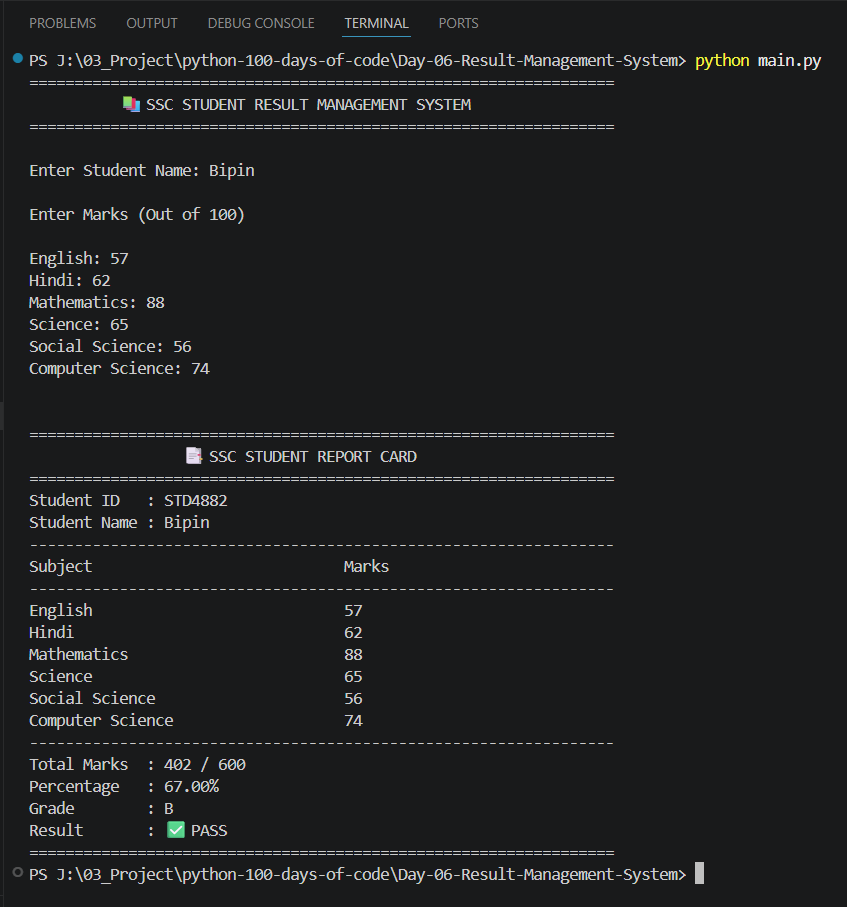

# 📚 Day 06 - Student Result Management System | 100 Days of Python

## 📌 Project Overview

This project is part of my **100 Days of Python Challenge**.

The objective of this project is to build a console-based **Student Result Management System** that generates a student's report card based on marks entered for multiple subjects.

The application validates user input, calculates the total marks and percentage, assigns a grade, determines the final result (Pass/Fail), and generates a formatted report card.

If the student fails in any subject, the application identifies the failed subject(s) and displays an appropriate result without calculating the percentage or assigning a grade.

Although the project is simple, it reinforces one of Python's most important concepts—**Functions**—while also revisiting several core programming fundamentals used in real-world applications.

---

## 🎯 Objectives

- Understand the importance of Functions
- Organize code into reusable modules
- Build a real-world console application
- Calculate student results dynamically
- Validate user input
- Generate a formatted report card

---

## 🛠️ Technologies Used

- Python 3

---

## 📚 Concepts Revised

- Functions
- Function Calling
- Function Parameters
- Return Values
- Variables
- User Input (`input()`)
- Lists
- List Iteration
- `for` Loops
- Conditional Statements (`if`, `elif`, `else`)
- Nested Conditional Logic
- Random Module (`random`)
- Input Validation
- Business Logic Implementation
- String Formatting (f-Strings)
- Code Reusability
- Modular Programming
- Basic Report Generation

---

## 💻 Source Code

```python
# Source code available in main.py
```

---

## ▶️ Sample Output

```text
=============================================================
          📚 SSC STUDENT RESULT MANAGEMENT SYSTEM
=============================================================

Enter Student Name: Bipin

Enter Marks (Out of 100)

English: 80
Hindi: 72
Mathematics: 91
Science: 84
Social Science: 76
Computer Science: 88

=============================================================
                 📑 SSC STUDENT REPORT CARD
=============================================================

Student ID   : STD5821
Student Name : Bipin

-------------------------------------------------------------
Subject                            Marks
-------------------------------------------------------------
English                            80
Hindi                              72
Mathematics                        91
Science                            84
Social Science                     76
Computer Science                   88
-------------------------------------------------------------
Total Marks  : 491 / 600
Percentage   : 81.83%
Grade        : A
Result       : PASS
=============================================================
```

---

## 📷 Project Output

Add your project screenshot here.

Example:



---

## 📖 What I Revised Today

While building this project, I reinforced my understanding of:

- Writing reusable functions with clear responsibilities
- Passing data between functions using parameters
- Returning values from functions
- Breaking a large problem into smaller reusable components
- Working with lists and iterating through them using `for` loops
- Implementing conditional business rules using `if`, `elif`, and `else`
- Validating user input before processing data
- Generating random values using Python's `random` module
- Formatting structured console output for better readability
- Designing a simple real-world application using modular programming principles

As a Python Backend Developer, revisiting these concepts helps strengthen the foundation for building clean, maintainable, and scalable applications where functions play a central role in organizing business logic.

---

## 📂 Project Structure

```text
Day-06-Student-Result-Management-System
│
├── README.md
├── main.py
├── output.png
├── demo.gif (Optional)
└── requirements.txt
```

---

⭐ Follow my journey as I complete the **100 Days of Python Challenge** while continuously strengthening Python fundamentals, improving problem-solving skills, and documenting my learning journey in public.