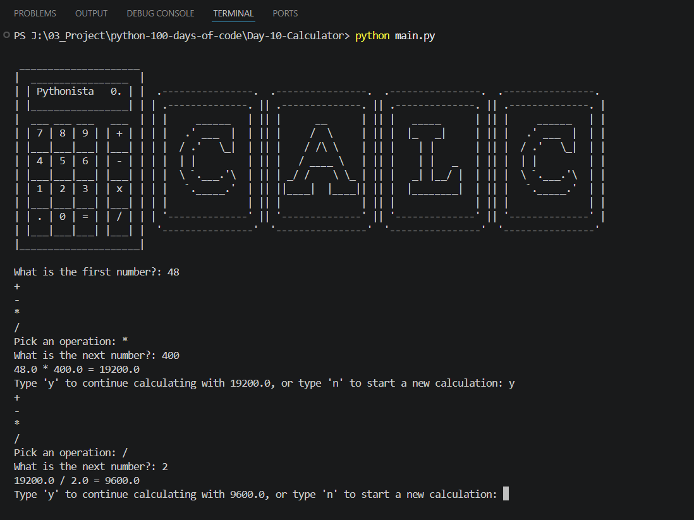

# 🧮 Day 10 - Calculator | 100 Days of Python

## 📌 Project Overview

This project is part of my **100 Days of Python Challenge**.

The objective of this project is to build a console-based **Calculator Application** capable of performing basic arithmetic operations such as addition, subtraction, multiplication, and division.

Instead of relying on multiple conditional statements, this project uses a **dictionary of functions** to dynamically execute mathematical operations. It also allows users to continue calculations using the previous result, creating a more interactive user experience.

---

## 🎯 Objectives

- Build an interactive calculator application
- Practice creating reusable functions
- Understand function references
- Store functions inside dictionaries
- Strengthen problem-solving through modular programming
- Improve user interaction using loops

---

## 🛠️ Technologies Used

- Python 3

---

## 📚 Concepts Reinforced

- Variables
- User Input (`input()`)
- Functions
- Function Parameters
- Return Statements
- Function References
- Dictionaries
- Dictionary Lookup
- `while` Loops
- Conditional Statements (`if`, `else`)
- Code Reusability
- Recursion
- f-Strings

---

## 💻 Source Code

```python
operations = {
    "+": add,
    "-": subtract,
    "*": multiply,
    "/": divide,
}

answer = operations[operation_symbol](num1, num2)
```

---

## ▶️ Sample Output

```text
What is the first number?: 25

+
-
*
/

Pick an operation: *

What is the next number?: 8

25 * 8 = 200

Type 'y' to continue calculating with 200, or type 'n' to start a new calculation:
```

---

## 📷 Project Output

Add your project screenshot here.

Example:



---

## 📖 What I Reinforced Today

While building this project, I strengthened my understanding of:

- Creating reusable functions
- Passing function references using dictionaries
- Building interactive command-line applications
- Implementing calculator logic
- Reusing previous calculation results
- Organizing code into modular components
- Improving application flow using loops and recursion

As a Python Backend Developer, revisiting these concepts helps improve code organization, maintainability, and the implementation of reusable business logic.

---

## 📂 Project Structure

```text
Day-10-Calculator
│
├── README.md
├── main.py
├── art.py
├── output.png
├── demo.gif
└── requirements.txt
```

---

## 💡 Engineering Takeaway

This project demonstrates how functions can be treated as first-class objects in Python by storing them inside a dictionary and invoking them dynamically.

This design pattern improves code readability, scalability, and maintainability, making it a valuable technique for implementing command dispatchers, routing systems, and business logic in backend applications.

Revisiting these concepts strengthens problem-solving skills and promotes writing cleaner, more modular Python code.

---

⭐ Follow my journey as I complete the **100 Days of Python Challenge** while continuously strengthening my Python fundamentals, improving problem-solving skills, and documenting my learning journey in public.